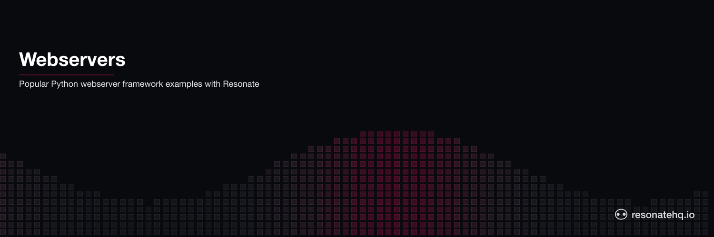

  <picture>
    <source media="(prefers-color-scheme: dark)" srcset="./assets/banner-dark.png">
    <source media="(prefers-color-scheme: light)" srcset="./assets/banner-light.png">
    
  </picture>

# Python webservers | Resonate example application

- [Django](./django-webserver/README.md)
- [FastAPI](./fastapi-webserver/README.md)
- [FlaskAPI](./flask-webserver/README.md)
