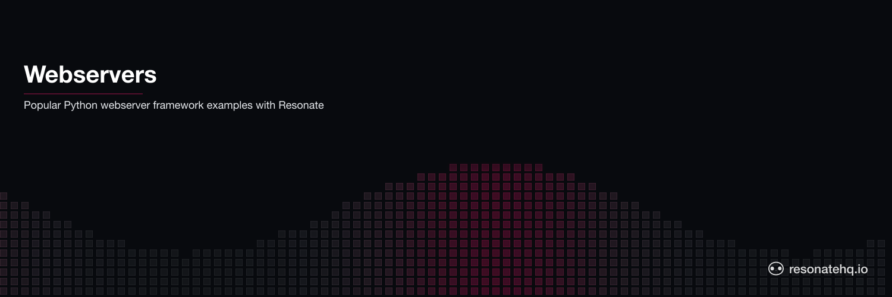

  <picture>
    <source media="(prefers-color-scheme: dark)" srcset="./assets/banner-dark.png">
    <source media="(prefers-color-scheme: light)" srcset="./assets/banner-light.png">
    
  </picture>

# Python webservers | Resonate example application

- [Django](./django-webserver/README.md)
- [FastAPI](./fastapi-webserver/README.md)
- [FlaskAPI](./flask-webserver/README.md)

Each directory is a self-contained project with its own dependencies. All three
serve the same workflow — `foo` calls `bar` calls `baz` — from an HTTP endpoint,
so the difference between them is only how the web framework reaches Resonate.

## Connecting a webserver to Resonate

The Resonate Python SDK is async, and its client must be created on a running
event loop: it starts a background network as it is constructed, so building one
at import time fails with `RuntimeError: no running event loop`. There is also
no in-process store, so each example needs a running Resonate server.

That leaves two shapes, and each example shows one of them:

- **FastAPI** is already async, so the client is created in the app's lifespan
  startup and awaited directly in the route.
- **Flask and Django** serve requests on threads with no event loop, so each
  keeps a dedicated event loop on a background thread, creates the client there,
  and has request handlers submit work to it and block for the result.
